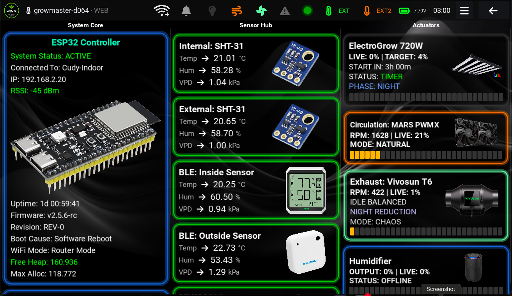
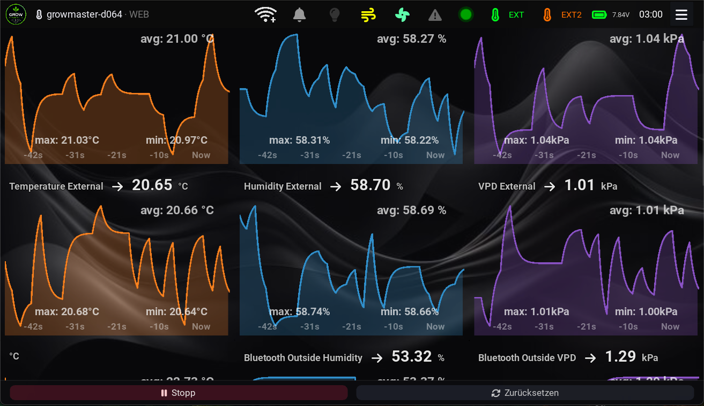
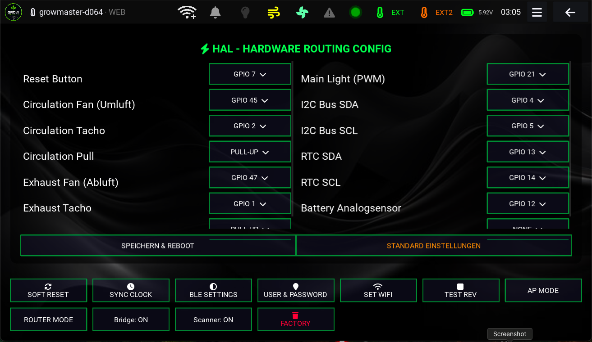

# Living Grow Controller

Ein Open-Source-Projekt zur intelligenten Steuerung von Umgebungsbedingungen. Dieses System kombiniert präzise Sensorik mit einer datenbasierten Regelung, um optimale Bedingungen für das Pflanzenwachstum zu schaffen.

## Einblicke in die UI

## Hardware & Aufbau
Das Projekt ist modular aufgebaut. Für den Betrieb werden folgende Komponenten benötigt:

* Mikrocontroller: [Hier z.B. ESP32 einfügen]
* Sensorik: [Hier Sensoren einfügen]
* Aktorik: [Hier Aktoren einfügen, z.B. Relais/Lüfter]
* Schaltplan: Detaillierte Verkabelungspläne folgen in Kürze.

## Software & Funktionen
* VPD-Regelung: Das Herzstück bildet die automatisierte Regelung basierend auf dem VPD (Vapor Pressure Deficit).
* Individuelle Limits: Sicherheitsanker für Temperatur und Luftfeuchtigkeit, um extreme Bedingungen zu vermeiden.
* Daten-Visualisierung: Flexible Dashboards inklusive Echtzeit-Trenddiagrammen für eine präzise Analyse.
* Synchronisation: 
## Lizenz
Dieses Projekt ist Open Source und steht unter der MIT-Lizenz. Details dazu findest du in der beiliegenden LICENSE-Datei.